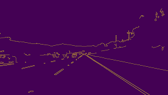
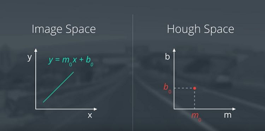
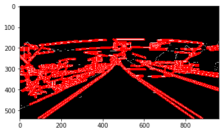
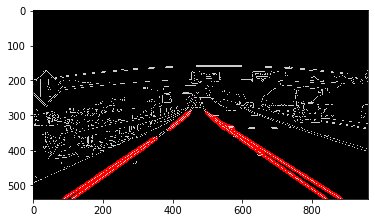
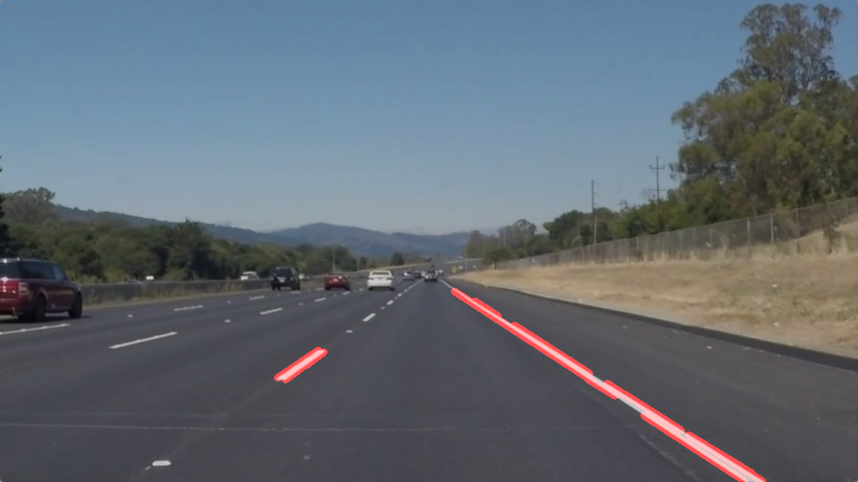
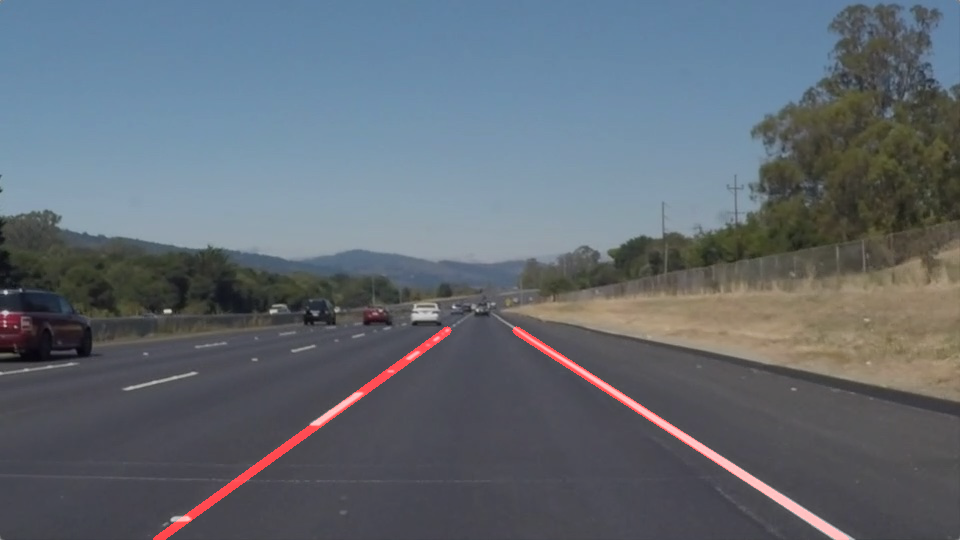

# SELF-DRIVING CAR: Finding Lane Lines.
## Project: Finding Lane Lines on the Road.

The goal of the project is to identify lane lines on the road. Given the test images and videos, end goal was to create a pipeline of code to achive the output as show in example folder [P1_example.mp4](examples/P1_example.mp4). For this project I have used Jupyter notebook to execute 
the project and you can see [this online](https://classroom.udacity.com/courses/ud1111) course from Udacity to know more about the tools used for the project.

## STEPS TO FIND LANE LINES

For lane detection on a video, we have to pass some steps that you can see below

1. Getting each frame from video
2. Making grayscale each frame
3. Detecting edges by using Canny Algorithm
4. Finding Lane by using Hough Algorithm
5. Improving output and making a new video as a result

In the project I have created the pipeline of the code, which takes Image as the input and image is passed though the pipeline 
(Series of algorithms).

## Canny Edge Detection

Honestly we can detect the lane lines on the image by providing few discription on RGB threshold value and the pattern of the lane
but the system will not be robust by this. To make the system robust, we have to use the computer vision algorithms. 
To make the system robust we have to detect the objects by their edges. To get the edges of the object we first convert the image to gray and then we have to compute the gradiant and by doing that we can find the edge by mesuring the level of change in gradient values between the pixels.


```python
edges = cv2.Canny(gray, low_threshold, high_threshold)
```

 

As you can see, just the important lines of the image which have strong edges have remained. The main question is, how we can extract straight lines from an image. The Hough Algorithm can answer this question.

## HOUGH TRANSFORM

The Hough transform is a feature extraction technique used in image analysis, computer vision, and digital image processing. The purpose of the technique is to find imperfect instances of objects within a certain class of shapes by a voting procedure. This voting procedure is carried out in a parameter space, from which object candidates are obtained as local maxima in a so-called accumulator space that is explicitly constructed by the algorithm for computing the Hough transform. The classical Hough transform was concerned with the identification of lines in the image, but later the Hough transform has been extended to identifying positions of arbitrary shapes, most commonly circles or ellipses. A line in image space can be represented as a single point in parameter space, or Hough Space. We use this theory for detecting lines in a picture. So for achieving this goal, we should add the result of the Canny Algorithm to Hough.



Hough Algorithm has some parameters which have role key in tuning algorithm fine. You can either put a long time for tuning parameters of algorithm or put an especial mask for eliminating other unuseful areas from the picture. Check the difference between using masked area and just tuning parameters of the Hough Algorithm. In the below images you can see the detected lines as red color.

Without Area Selection(unMasked)


```python
vertices = np.array([[(0, imshape[0]), (0, 0), (imshape[1], 0), (imshape[1], imshape[0])]], dtype=np.int32)
```



Suitable Area Selection(Masked)


```python
    vertices = np.array([[(0,imshape[0]),(460, 318), (490, 318), (imshape[1],imshape[0])]], dtype=np.int32)
```



But you can see in the above image that the left lane is not continues and some frames will result as shown in below image



To over come above issue, we have to apply below logic on output of Hough Image.After getting x1,y1,x2,y2 from cv2.HoughLinesP call, we have to average and/or extrapolate the line segments we've detected to map out the full extent of the lane lines.


```python
lines = cv2.HoughLinesP(img, rho, theta, threshold, np.array([]), minLineLength=min_line_len, maxLineGap=max_line_gap)
```

To extrapolate and find the mean we have to convert the line obtained in Image domain to Hough parameter domain and find the mean of M and B points obtained and derive the lane lines from the mean parameter points obtained.


```python
# Get the mean of all the lines values
    AvgPositiveM = mean(mPositiveValues)
    AvgNegitiveM = mean(mNegitiveValues)
    AvgLeftB     = mean(bLeftValues)
    AvgRightB    = mean(bRightValues)

    # use average slopes to generate line using ROI endpoints
    if AvgPositiveM != 0:
        x1_Left = (y_max - AvgLeftB)/AvgPositiveM
        y1_Left = y_max
        x2_Left = (y_min - AvgLeftB)/AvgPositiveM
        y2_Left = y_min
        cv2.line(img, (int(x1_Left), int(y1_Left)), (int(x2_Left), int(y2_Left)), color, thickness) #avg Left Line
    if AvgNegitiveM != 0:
        x1_Right = (y_max - AvgRightB)/AvgNegitiveM
        y1_Right = y_max
        x2_Right = (y_min - AvgRightB)/AvgNegitiveM
        y2_Right = y_min
        # define average left and right lines
        cv2.line(img, (int(x1_Right), int(y1_Right)), (int(x2_Right), int(y2_Right)), color, thickness) #avg Right Line
```

    After adding above code in our logic we will get the result as in below image



Above algorithm works fine for videos as well considering videos are series of images.
